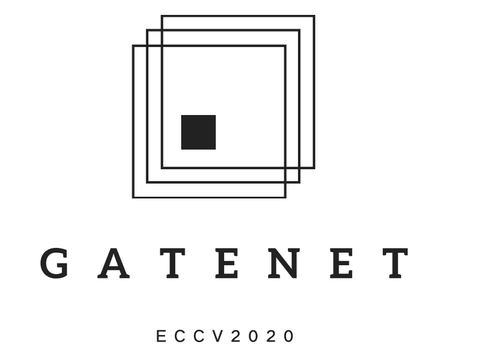

<p align="center">

  


  <h3 align="center">Suppress and Balance: A Simple Gated Network for Salient Object Detection</h3>

  <p align="center">
    Xiaoqi Zhao*, Youwei Pang*, Lihe Zhang, Huchuan Lu, Lei Zhang
    <br />
    <a href="https://arxiv.org/pdf/2007.08074.pdf"><strong>⭐ arXiv »</strong></a>
    <a href="./2852.pdf" target="_black">[Slides]</a>
    <br />
  </p>
</p>

The official repo of the ECCV 2020 (oral) paper, Suppress and Balance: A Simple Gated Network for Salient Object Detection.  
## Results(RGB/RGB-D SOD, VOS)
RGB SOD: [Google Drive](https://drive.google.com/file/d/12y1hwdUFE0ZVRnjFjj4UwI-q9id6BFvs/view?usp=sharing) / [BaiduYunPan(4ha3)](https://pan.baidu.com/s/1v967xG867F72Wfy_0J-KbQ) 
RGB-D SOD: [Google Drive](https://drive.google.com/file/d/1Yz23lPdZaJ_WqLQv9l0QwrHLFF6W24Pp/view?usp=sharing) / [BaiduYunPan(9her)](https://pan.baidu.com/s/1mvgw_9w22PP5fpvHEDAx3A)
VOS: [Google Drive](https://drive.google.com/file/d/1k2DCR32h8bjz-nMOsF8NKvv-5iAGI0_1/view?usp=sharing) / [BaiduYunPan(0hue)](https://pan.baidu.com/s/1somDG0QlupQ9kwWccVg1aQ)
## Related Works
* (ECCV 2020) A Single Stream Network for Robust and Real-time RGB-D Salient Object Detection: https://github.com/Xiaoqi-Zhao-DLUT/DANet-RGBD-Saliency
* (ECCV 2020) Hierarchical Dynamic Filtering Network for RGB-D Salient Object Detection: https://github.com/lartpang/HDFNet
* (CVPR 2020) Multi-scale Interactive Network for Salient Object Detection: https://github.com/lartpang/MINet
## Trained Model
You can download the trained VGG-16/ResNet-50 GateNet model at [BaiduYunPan(s3l2)](https://pan.baidu.com/s/1-S9fhoCu8fHwi5WKjUCf_g).
## Requirement
* Python 3.7
* PyTorch 1.5.0
* torchvision
* numpy
* Pillow
* Cython
## Training
1.Set the path of training sets in config.py  
2.Run train.py  
We also release the new baseline, Gated FPN in [model_GatedFPN_newbaseline.py]. You can use it for future reserach.
## Testing
1.Set the path of testing sets in config.py    
2.Run generate_salmap.py (can generate the predicted saliency maps)  
3.Run generate_visfeamaps.py (can visualize feature maps)  
4.Run test_metric_score.py (can evaluate the predicted saliency maps in terms of fmax,fmean,wfm,sm,em,mae). You also can use the toolkit released by us:https://github.com/lartpang/Py-SOD-VOS-EvalToolkit.

We also recommend you to use another code released by Jun Wei https://github.com/weijun88/F3Net. Based on the training strategy of this code, our performance can be further improved( but for fair comparisons, we do not use the multi-scale training trick), the performance as follows:  
(ResNet-50-GateNet)  
dataset: DUTS MAE: 0.0375 maxF: 0.8899 avgF: 0.8199 wfm: 0.8225 Sm: 0.8889 Em: 0.9133  
dataset: HKU-IS MAE: 0.0317 maxF: 0.9353 avgF: 0.9010 wfm: 0.8873 Sm: 0.9187 Em: 0.9558  
dataset: ECSSD MAE: 0.0355 maxF: 0.9486 avgF: 0.9217 wfm: 0.9049 Sm: 0.9269 Em: 0.9513  
dataset: DUT-OMRON MAE: 0.0536 maxF: 0.8157 avgF: 0.7497 wfm: 0.7365 Sm: 0.8386 Em: 0.8697  
dataset: PASCAL-S MAE: 0.0648 maxF: 0.8882 avgF: 0.8400 wfm: 0.8213 Sm: 0.8625 Em: 0.8958  
In addition, this performance is based on a model that reduces the number of output channels of Fold-ASPP by half, so the entire parameter and model size can be greatly reduced. We believe that Fold-ASPP can still be optimized in the future.
## BibTex  
```
@inproceedings{GateNet,
  title={Suppress and Balance: A Simple Gated Network for Salient Object Detection},
  author={Zhao, Xiaoqi and Pang, Youwei and Zhang, Lihe and Lu, Huchuan and Zhang, Lei},
  booktitle=ECCV,
  year={2020}
}
```
