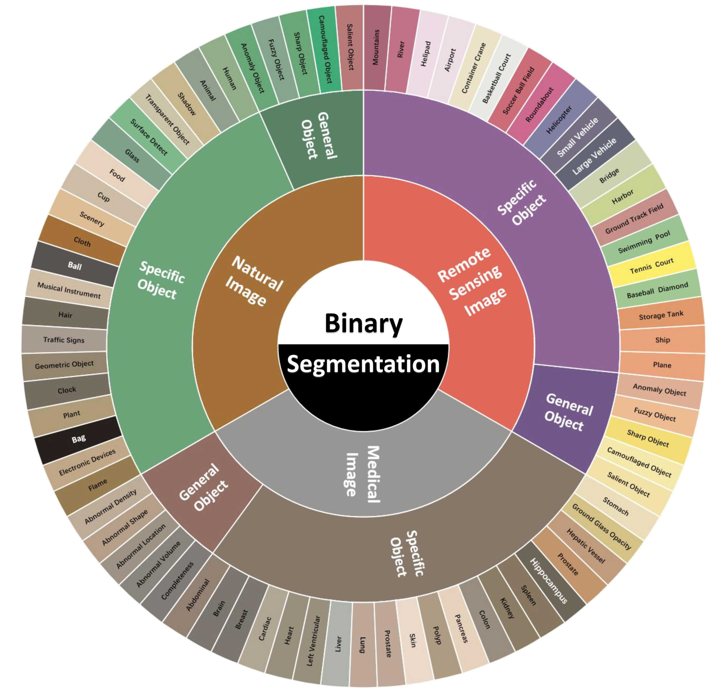
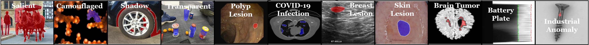
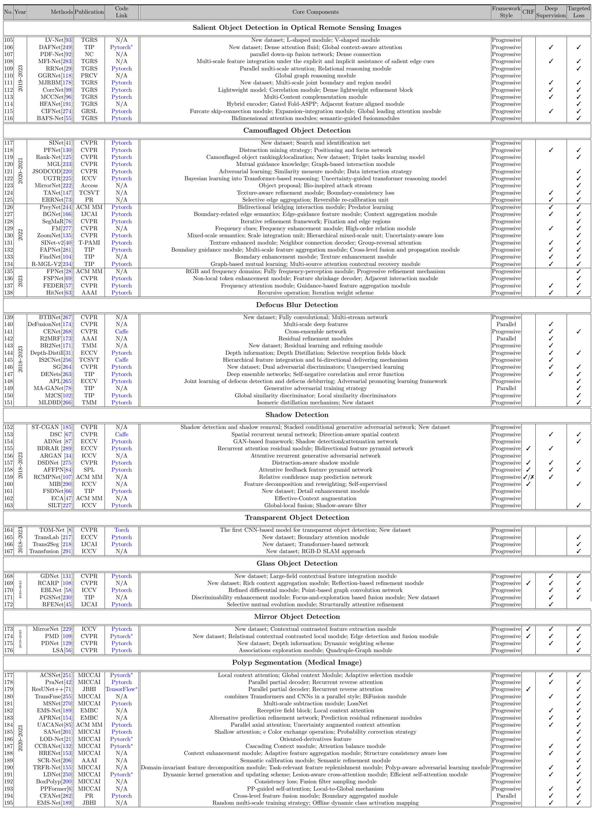
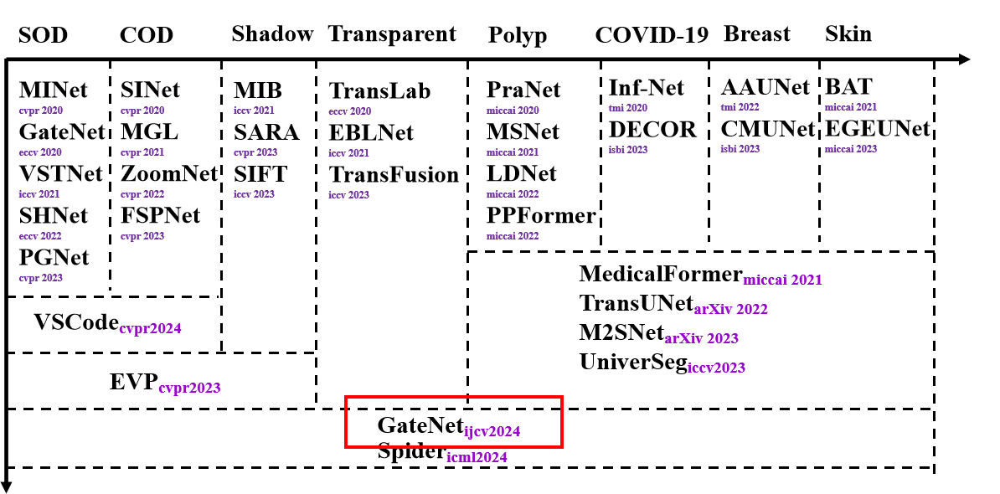
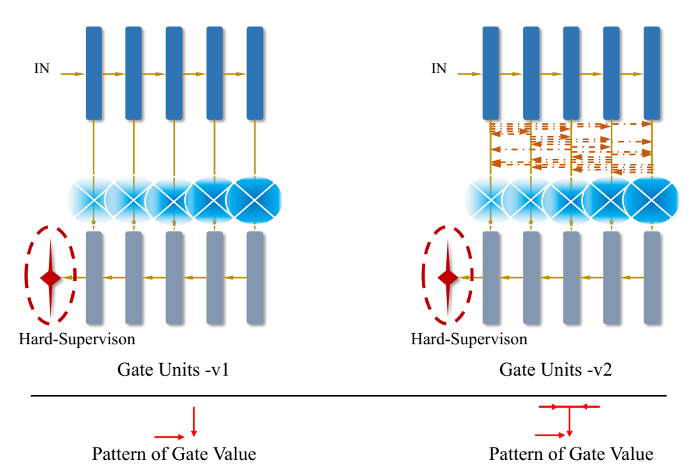
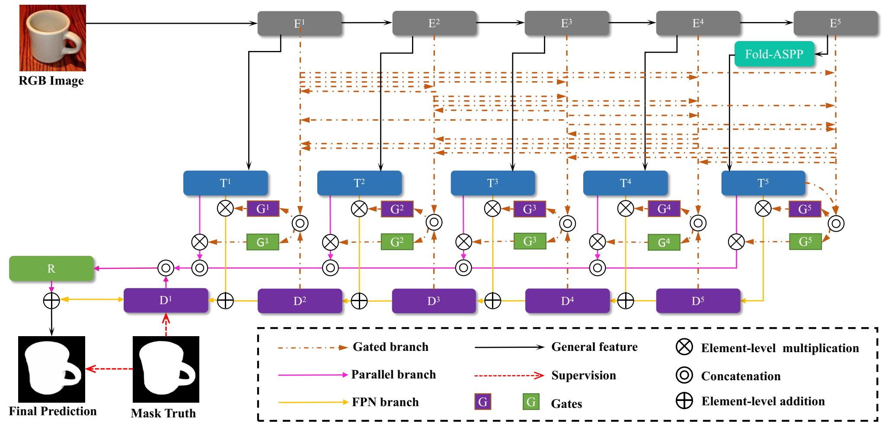
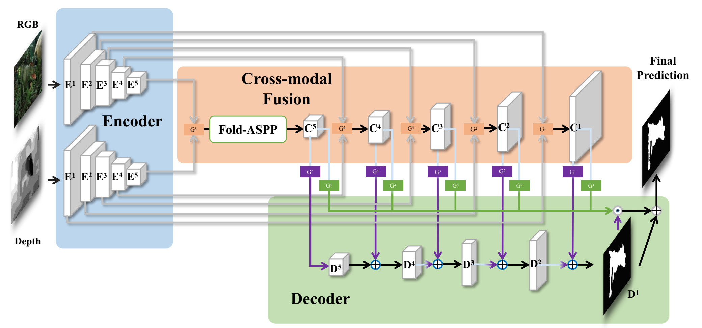
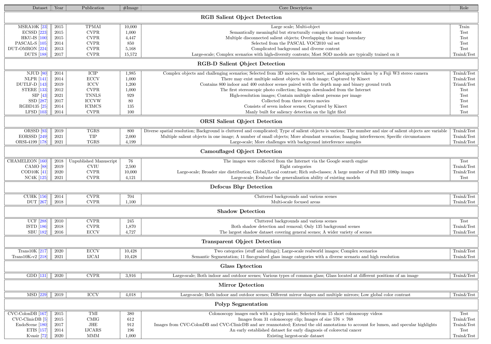
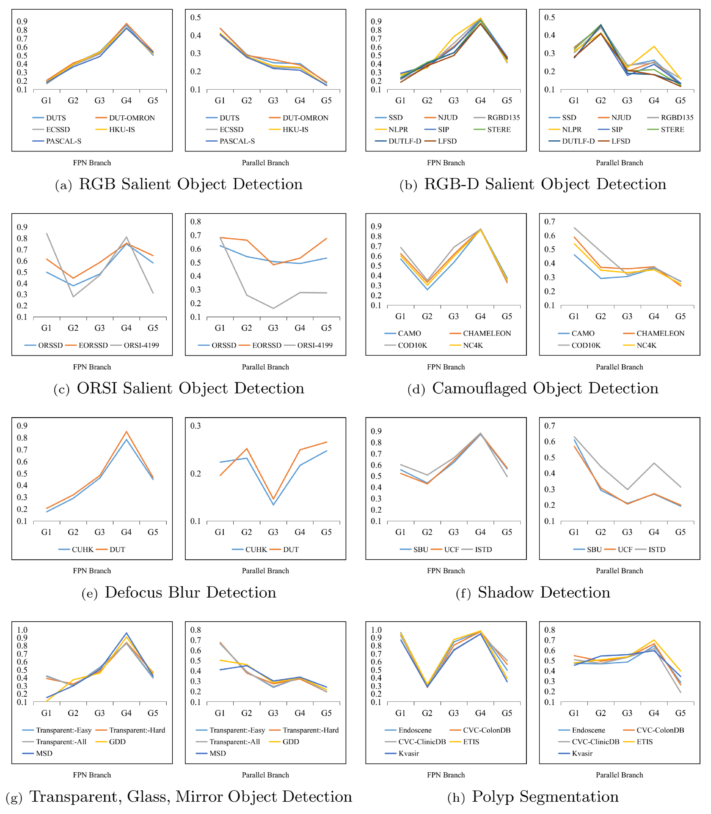

### Suppress and Balance: A Simple Gated Network for Salient Object Detection, ECCV 2020 oral (master branch)  
### Towards Diverse Binary Segmentation via A Simple yet General Gated Network, IJCV 2024 (gatenetv2 branch)

<br />
<p align="center">
  <h1 align="center">Towards Diverse Binary Segmentation via A Simple yet General Gated Network</h1>
  <p align="center">
    IJCV, 2024
    <br />
    <a href="https://xiaoqi-zhao-dlut.github.io/"><strong>Xiaoqi Zhao*</strong></a>
    ·
    <a href="https://lartpang.github.io/"><strong>Youwei Pang*</strong></a>
    ·
    <a href="https://scholar.google.com/citations?hl=zh-CN&user=XGPdQbIAAAAJ"><strong>Lihe Zhang</strong></a>
    ·
    <a href="https://scholar.google.com/citations?hl=zh-CN&user=D3nE0agAAAAJ"><strong>Huchuan Lu</strong></a>  
    ·
    <a href="https://scholar.google.com/citations?user=tAK5l1IAAAAJ&hl"><strong>Lei Zhang</strong></a>
  </p>

  <p align="center">
    <a href='https://arxiv.org/pdf/2303.10396'>
      
    </a>
  </p>
<br />

## Binary Segmentation and Context-dependent (CD) Concepts
<p align="center">
     <br />
</p>
<p align="center">
     <br />
</p>

### More introductions to the CD concept can be found in our <a href="https://arxiv.org/pdf/2405.01002"><strong>Spider</strong></a> and <a href="https://arxiv.org/pdf/2412.01240"><strong>SAM-EVA</strong></a>.

## Motivation - Unified Structure and Multi-concept Generalization
We survey 200+ works on binary segmenation of different CD concepts.
- **Previous research focused too much on single concept studies**
- **Repeated designs**
- **Similar technical challenges**
<p align="center">
     <br />
</p>
<p align="center">
     <br />
</p>
<p align="center">
     <br />
</p>

## Motivation - Gate Units-v1 vs. Gate Units-v2
<p align="center">
     <br />
</p>

## GateNetv2 Framework
### Single Stream
<p align="center">
     <br />
</p>

### Two Streams
<p align="center">
     <br />
</p>

## Datasets
<p align="center">
     <br />
</p>

## Trained Models
-  GateNetv2_res2net50_polyp [GitHub Release](https://github.com/Xiaoqi-Zhao-DLUT/GateNet-RGB-Saliency/releases/download/v1.1/GateNetv2_res2net50_polyp_train_strategy2_mstrain_batch24_100epochModel_100_gen.pth)
-  GateNetv2_res2net50_rgbdsod [GitHub Release](https://github.com/Xiaoqi-Zhao-DLUT/GateNet-RGB-Saliency/releases/download/v1.1/GateNetv2_res2net50_rgbdsod_train_strategy2_mstrain_batch16_100epochModel_100_gen.pth)
-  GateNetv2_resnet50d_cod [GitHub Release](https://github.com/Xiaoqi-Zhao-DLUT/GateNet-RGB-Saliency/releases/download/v1.1/GateNetv2_resnet50d_cod_train_strategy2_mstrain_batch24_100epochModel_100_gen.pth)
-  GateNetv2_resnet50d_duts [GitHub Release](https://github.com/Xiaoqi-Zhao-DLUT/GateNet-RGB-Saliency/releases/download/v1.1/GateNetv2_resnet50d_duts_train_strategy2_mstrain_batch24_100epoochModel_100_gen.pth)
-  GateNetv2_resnet50d_rgbdsod [GitHub Release](https://github.com/Xiaoqi-Zhao-DLUT/GateNet-RGB-Saliency/releases/download/v1.1/GateNetv2_resnet50d_rgbdsod_train_strategy2_mstrain_batch16_10OepochModel_100_gen.pth)
-  GateNetv2_resnet50d_transparent [GitHub Release](https://github.com/Xiaoqi-Zhao-DLUT/GateNet-RGB-Saliency/releases/download/v1.1/GateNetv2_resnet50d_transparent_train_strategy2_mstrain_batch24_100epochModel_100_gen.pth)
-  GateNetv2_resnext101_GDD [GitHub Release](https://github.com/Xiaoqi-Zhao-DLUT/GateNet-RGB-Saliency/releases/download/v1.1/GateNetv2_resnext101_GDD_train_strategy2_mstrain_batch16_100epochModel_100_gen.pth)
-  GateNetv2_resnext101_istd [GitHub Release](https://github.com/Xiaoqi-Zhao-DLUT/GateNet-RGB-Saliency/releases/download/v1.1/GateNetv2_resnext101_istd_train_strategy2_mstrain_batch16_100epochModel_100_gen.pth)
-  GateNetv2_resnext101_MSD [GitHub Release](https://github.com/Xiaoqi-Zhao-DLUT/GateNet-RGB-Saliency/releases/download/v1.1/GateNetv2_resnext101_MSD_train_strategy2_mstrain_batch16_100epoch_Model_100_gen.pth)
-  GateNetv2_resnext101_sbu [GitHub Release](https://github.com/Xiaoqi-Zhao-DLUT/GateNet-RGB-Saliency/releases/download/v1.1/GateNetv2_resnext101_sbu_train_strategy2_mstrain_batch16_100epochModel_100_gen.pth)
-  GateNetv2_vgg16_DBD [GitHub Release](https://github.com/Xiaoqi-Zhao-DLUT/GateNet-RGB-Saliency/releases/download/v1.1/GateNetv2_vgg16_DBD_train_strategy2_mstrain_batch8_100epeochModel_100_gen.pth)
-  GateNetv2_vgg16_EORSSD [GitHub Release](https://github.com/Xiaoqi-Zhao-DLUT/GateNet-RGB-Saliency/releases/download/v1.1/GateNetv2_vgg16_EORSSD_train_strategy2_mstrain_batch8_100epochModel_100_gen.pth)
-  GateNetv2_vgg16_ORSI_4199 [GitHub Release](https://github.com/Xiaoqi-Zhao-DLUT/GateNet-RGB-Saliency/releases/download/v1.1/GateNetv2_vgg16_ORSI_4199_train_strategy2_mstrain_batch8_100eepochModel_100_gen.pth)
-  GateNetv2_vgg16_ORSSD [GitHub Release](https://github.com/Xiaoqi-Zhao-DLUT/GateNet-RGB-Saliency/releases/download/v1.1/GateNetv2_vgg16_ORSSD_train_strategy2_mstrain_batch8_100epoch_Model_100_gen.pth)
## Prediction Maps
- RGB Salient Object Detection [GitHub Release](https://github.com/Xiaoqi-Zhao-DLUT/GateNet-RGB-Saliency/releases/download/v1.0/GateNetv2_resnet50d_duts_train_strategy2_mstrain_batch24_100epochModel_100_genepoch.zip)
- RGBD Salient Object Detection [GitHub Release](https://github.com/Xiaoqi-Zhao-DLUT/GateNet-RGB-Saliency/releases/download/v1.0/GateNetv2_resnet50d_rgbdsod_train_strategy2_mstrain_batch16_100epochModel_100_genepoch.zip)
- ORSI Salient Object Detection [EORSSD] [GitHub Release](https://github.com/Xiaoqi-Zhao-DLUT/GateNet-RGB-Saliency/releases/download/v1.0/GateNetv2_vgg16_EORSSD_train_strategy2_mstrain_batch8_100epochModel_100_genepoch.zip)
- ORSI Salient Object Detection [ORSI_4199] [GitHub Release](https://github.com/Xiaoqi-Zhao-DLUT/GateNet-RGB-Saliency/releases/download/v1.0/GateNetv2_vgg16_ORSI_4199_train_strategy2_mstrain_batch8_100epochModel_100_genepoch.zip)
- ORSI Salient Object Detection [ORSSD] [GitHub Release](https://github.com/Xiaoqi-Zhao-DLUT/GateNet-RGB-Saliency/releases/download/v1.0/GateNetv2_vgg16_ORSSD_train_strategy2_mstrain_batch8_100epochModel_100_genepoch.zip)
- Camouflaged Object Detection [GitHub Release](https://github.com/Xiaoqi-Zhao-DLUT/GateNet-RGB-Saliency/releases/download/v1.0/GateNetv2_resnet50d_cod_train_strategy2_mstrain_batch24_100epochModel_100_genepoch.zip)
- Transparent Object Segmentation [GitHub Release](https://github.com/Xiaoqi-Zhao-DLUT/GateNet-RGB-Saliency/releases/download/v1.0/GateNetv2_resnet50d_transparent_train_strategy2_mstrain_batch24_100epochModel_100_genepoch.zip)
- Glass Detection [GitHub Release](https://github.com/Xiaoqi-Zhao-DLUT/GateNet-RGB-Saliency/releases/download/v1.0/GateNetv2_resnext101_GDD_train_strategy2_mstrain_batch16_100epochModel_100_genepoch.zip)
- Shadow Detection [ISTD] [GitHub Release](https://github.com/Xiaoqi-Zhao-DLUT/GateNet-RGB-Saliency/releases/download/v1.0/GateNetv2_resnext101_istd_train_strategy2_mstrain_batch16_100epochModel_100_genepoch.zip)
- Shadow Detection [SBU,UCF] [GitHub Release](https://github.com/Xiaoqi-Zhao-DLUT/GateNet-RGB-Saliency/releases/download/v1.0/GateNetv2_resnext101_sbu_train_strategy2_mstrain_batch16_100epochModel_100_genepoch.zip)
- Mirror Detection [GitHub Release](https://github.com/Xiaoqi-Zhao-DLUT/GateNet-RGB-Saliency/releases/download/v1.0/GateNetv2_resnext101_MSD_train_strategy2_mstrain_batch16_100epochModel_100_genepoch.zip)
- Defocus Blur Detction [GitHub Release](https://github.com/Xiaoqi-Zhao-DLUT/GateNet-RGB-Saliency/releases/download/v1.0/GateNetv2_vgg16_DBD_train_strategy2_mstrain_batch8_100epochModel_100_genepoch.zip)
- Colon Polyp Segmentation [GitHub Release](https://github.com/Xiaoqi-Zhao-DLUT/GateNet-RGB-Saliency/releases/download/v1.0/GateNetv2_res2net50_polyp_train_strategy2_mstrain_batch24_100epochModel_100_genepoch.zip)
## Training
Set the path of training sets in train_GateNetv2_RGB.py or train_GateNetv2_RGB-D.py 
```
python train_GateNetv2_RGB.py / train_GateNetv2_RGB-D.py
```
## Testing
Set the path of testing sets in utils/config.py 
```
python prediction_rgb.py / prediction_rgbd.py
```
Gatevalue
```
python compute_gatevalue.py / compute_gatevalue_two_stream.py
```
<p align="center">
     <br />
</p>

## Evaluation Tools

- <https://github.com/Xiaoqi-Zhao-DLUT/PySegMetric_EvalToolkit>
  
## BibTex  
```
@article{GateNetv2,
  title={Towards diverse binary segmentation via a simple yet general gated network},
  author={Zhao, Xiaoqi and Pang, Youwei and Zhang, Lihe and Lu, Huchuan and Zhang, Lei},
  journal={International Journal of Computer Vision},
  volume={132},
  number={10},
  pages={4157--4234},
  year={2024}
}

```
